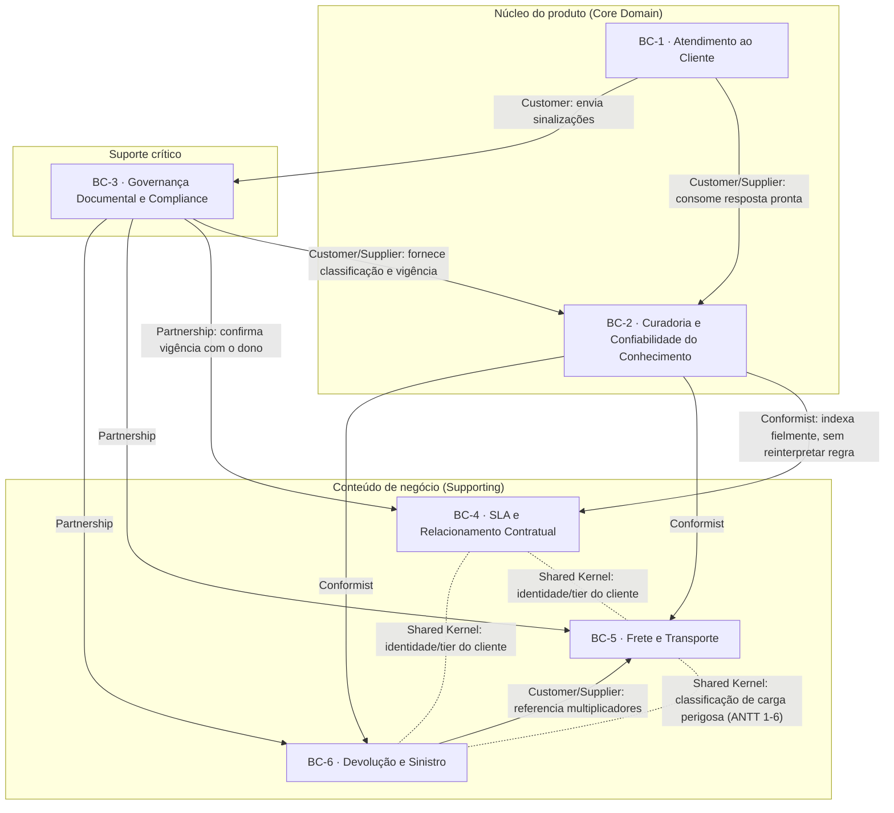

# Recorte de Domínio e Bounded Contexts — Projeto NovaTech

**Versão:** 2.0 — revisão de coerência com o domínio (ver Nota de Revisão abaixo)
**Metodologia:** DDD (Domain-Driven Design) para o recorte estratégico e tático do domínio, combinado com SDD (Spec Driven Development) como ponte para os artefatos de `requirements.md` do repositório.
**Autor:** Product Specialist, DB1
**Base utilizada:** cenário completo (Fases 1 e 2), Anexo A (documentação NovaTech), discovery simulado com stakeholders, jornada do atendente, especificação de requisitos de RAG v2.0, revisão de QA de testabilidade, e estrutura de repositório (Anexo C).
**Objetivo:** antes de escrever qualquer `requirements.md`, estabelecer as fronteiras de linguagem e responsabilidade que vão orientar specs, skills e o próprio AGENTS.md — para que agentes de IA gerando código, testes ou documentação não produzam outputs genéricos por falta de recorte de domínio.

---

## Nota de revisão (v1 → v2)

Revisão solicitada: verificar se os bounded contexts estavam coerentes com o domínio de **logística** — isto é, definidos por capacidade e regra de **negócio**, não por componente de arquitetura ou tecnologia.

**Achado:** a v1 misturou os dois planos em três pontos:

1. **BC-2 estava nomeado e descrito em termos de tecnologia, não de negócio** — "Conhecimento e Recuperação (RAG)" cita uma técnica de implementação (Retrieval-Augmented Generation) no próprio nome do contexto, e seu conteúdo incluía "ingestão, chunking, embeddings, indexação vetorial" e "hierarquia física dos chunks... como filtro de retrieval" — chunk, embedding e indexação vetorial são unidades e mecanismos de uma solução técnica específica, substituíveis por outra tecnologia sem que a regra de negócio mude. Isso é o erro mais grave da v1: um bounded context deve sobreviver a uma troca de stack.
2. **BC-1 citava o canal de integração ("Teams") como parte da definição do contexto** — o canal é decisão de arquitetura/integração (poderia ser Teams, e-mail, um portal web); a regra de negócio é "o atendente faz uma pergunta e recebe resposta com fonte e confiança", independente de onde isso acontece.
3. **BC-3 citava a tecnologia de identidade ("Azure AD/SharePoint") como parte da regra de controle de acesso**, e usava "chunk" (unidade técnica de BC-2) para descrever a granularidade da classificação de confidencialidade.

**Correção aplicada:** BC-2 foi renomeado para **Curadoria e Confiabilidade do Conhecimento**, com o conteúdo reescrito como regra de negócio pura (qual fonte prevalece, o que significa "vigente", como se calcula confiança) — a tecnologia de armazenamento/busca foi explicitamente movida para "está fora" deste contexto, como decisão de arquitetura do Tech Lead. As referências a "Teams" e "Azure AD/SharePoint" foram generalizadas para o conceito de negócio equivalente (canal de atendimento; papéis/perfis organizacionais), sem prescrever tecnologia. Todas as seções dependentes (mapa de contexto, glossário, mapeamento para o SDD, riscos e autocrítica) foram atualizadas para refletir a correção. As mudanças estão marcadas com 🔧 ao longo do documento.

---

## 1. O domínio e sua declaração

**Domínio do negócio (NovaTech):** logística — transporte de cargas, com processos de frete, devolução, SLA contratual e atendimento ao cliente.

**Domínio do projeto (o que a DB1 está construindo):** um assistente de IA que faz a ponte entre a documentação operacional da NovaTech (frequentemente incompleta, desatualizada ou contraditória) e o atendente humano, respondendo com precisão, fonte rastreável e nível de confiança explícito.

Isso importa para o recorte: o projeto **não está automatizando a logística** (não decide se uma devolução é aprovada, não emite CT-e, não calcula frete para cobrança). Ele está automatizando o **acesso confiável ao conhecimento** sobre essas regras. Esse deslocamento — de "sistema que executa a regra" para "sistema que informa a regra com rastreabilidade" — é a base de todo o recorte abaixo.

### 1.1 Classificação estratégica dos subdomínios

| Subdomínio | Classificação | Por quê |
|---|---|---|
| Atendimento assistido por IA (jornada, confiança, fallback, feedback) | **Core** | É o que a NovaTech está comprando: não é "ter um chatbot", é reduzir 12→2 min/chamado sem perder confiabilidade. Nenhuma vantagem competitiva vem de reimplementar frete ou SLA — vem de fazer a resposta certa chegar rápido e com prova. |
| Curadoria e confiabilidade do conhecimento (autoridade entre fontes, vigência, nível de confiança) 🔧 | **Core** | O risco nº 1 do projeto (Exercício 1.1, DM) é a alucinação e a contaminação entre versões (PROC-042 v1/v2). Resolver isso bem — decidir qual fonte vale e com que grau de certeza, como regra de negócio — é o diferencial real do produto frente a "um ChatGPT com os dados da empresa". A tecnologia que implementa essa regra (indexação, busca) não faz parte do subdomínio em si. |
| Governança documental e compliance (donos, SLA de revisão, confidencialidade, auditoria) | **Supporting crítico** | Sustenta o Core, mas não é o que o atendente vê diretamente. Sem governança o Core degrada com o tempo — é pré-condição, não diferencial de produto em si. |
| Conteúdo de negócio: SLA e relacionamento contratual | **Supporting** | Regra de negócio da NovaTech, não da DB1. O assistente consome, não define. |
| Conteúdo de negócio: frete e transporte | **Supporting** | Idem — inclusive é o subdomínio com a contradição documental mais grave da amostra (PROC-042). |
| Conteúdo de negócio: devolução e sinistro | **Supporting** | Idem — inclui um gap real (processo de sinistro nunca formalizado). |
| Identidade e perfis organizacionais de acesso 🔧 | **Generic** | A regra de negócio ("supervisor e jurídico veem mais do que atendente padrão") já existe na estrutura de cargos da NovaTech; o projeto reaproveita essa hierarquia por meio de um provedor de identidade já existente — a escolha de qual provedor é decisão técnica, fora deste recorte de domínio. |

---

## 2. Bounded contexts propostos

Seis contextos. Os dois primeiros formam o núcleo do produto; os quatro seguintes contêm o conteúdo de negócio que o núcleo consome — cada um com vocabulário próprio o suficiente para gerar confusão se misturado (é exatamente esse vocabulário que o discovery e o Anexo B mostraram um LLM confundir: "vigente" vs "válido", "Gold" como tier vs metal, "frete especial" com dois conjuntos de multiplicadores).

---

### BC-1 — Atendimento ao Cliente
**Tipo:** Core
**Responsabilidade central:** mediar a interação entre o atendente humano, o cliente final e o conhecimento curado pelo BC-2, garantindo que toda resposta chegue com fonte, confiança e caminho de exceção. 🔧

**Está dentro:**
- Recepção da pergunta do atendente, no canal de atendimento em uso no dia a dia (a regra de negócio independe de qual canal é esse). 🔧
- Apresentação da resposta com fonte, versão, confiança (Alta/Média/Baixa) e, quando aplicável, os selos `[NÃO OFICIAL]` / `[RESPOSTA GENÉRICA]`.
- Fluxo de fallback: baixa confiança, conflito de fonte, ausência de base documental, ou discordância do próprio atendente.
- Escalonamento ao supervisor ou ao dono do documento, com contexto anexado.
- Sinalização de resposta errada/desatualizada/incompleta (gatilho do feedback; a gestão da sinalização em si é do BC-3).
- Encerramento do chamado com registro do que foi usado.

**Está fora:**
- Como a fonte certa é encontrada e como o grau de certeza é decidido — isso é regra de negócio do BC-2; o Atendimento apenas recebe e exibe o resultado já pronto. 🔧
- O conteúdo das regras de frete/SLA/devolução — BCs 4, 5, 6.
- Quem pode ver o quê (perfis, confidencialidade) — BC-3, ainda que o efeito apareça aqui.
- Qualquer tecnologia de canal, mensageria ou integração usada para a conversa acontecer — decisão de arquitetura, não de domínio. 🔧

**Linguagem própria:** chamado, atendente, cliente, dúvida, escalonamento, confiança, fonte, sinalização, chamado encerrado, botão de sinalização, aviso de baixa confiança.

**Dono conceitual:** Atendimento (Fernanda Lima, no discovery) + Product Specialist.

**Relação com outros:** *Customer* do BC-2 (consome respostas já resolvidas, com confiança já calculada) e do BC-3 (recebe classificação de "não oficial"/confidencial já aplicada). Fornece ao BC-3 os eventos de sinalização.

---

### BC-2 — Curadoria e Confiabilidade do Conhecimento 🔧 *(renomeado — v1: "Conhecimento e Recuperação (RAG)")*
**Tipo:** Core
**Responsabilidade central:** decidir, para qualquer tema com mais de uma fonte disponível, qual conteúdo tem autoridade para responder, em que estado de validade ele está, e com que grau de confiança essa resposta pode ser entregue. É a regra de negócio que resolve — sem depender de um humano a cada pergunta — o problema central do projeto: documentação contraditória, desatualizada ou não oficial convivendo sem hierarquia declarada.

**Está dentro:**
- Regra de precedência entre fontes quando mais de uma trata do mesmo tema: documento oficial vigente > documento oficial sem vigência confirmada > item de FAQ validado pelo comitê > item de FAQ não validado. É essa regra — não uma tecnologia de busca — que resolve o caso PROC-042 v1/v2.
- Ciclo de vida de validade de um documento (`vigente`, `revogado`, `vigência não confirmada`, `sujeito a revisão`) e o efeito de negócio de cada estado: um documento `revogado` nunca fundamenta uma resposta; um `sujeito a revisão` sempre reduz a confiança da resposta.
- Regra objetiva de cálculo do nível de confiança de uma resposta (Alta/Média/Baixa) a partir da hierarquia de autoridade e do estado de validade das fontes envolvidas.
- Regra de quando uma resposta deve ser rotulada como "genérica" (sem lastro documental da NovaTech) em vez de citar uma fonte, e quando deve simplesmente admitir que não encontrou.
- O critério de proximidade temática entre uma pergunta e o conteúdo que a responde, espelhando a forma como a própria NovaTech organiza sua documentação por área responsável e tema (ex.: Comercial > Frete) — um critério de negócio, não uma técnica de indexação.

**Está fora:**
- Qualquer tecnologia ou mecanismo de armazenamento, busca ou processamento de texto (ingestão, chunking, embeddings, banco vetorial) — isso é decisão de arquitetura do Tech Lead, registrada em ADR; este bounded context não pressupõe nenhuma tecnologia específica e deve continuar válido mesmo se a tecnologia por trás dele mudar. 🔧
- A interação com o atendente (BC-1).
- Quem é dono de cada fonte, SLA de revisão, classificação de confidencialidade — são *decididos* no BC-3 e apenas *consumidos* aqui como dado de entrada.
- O conteúdo semântico das regras de frete/SLA/devolução em si — para este contexto, PROC-042 é uma fonte com um estado de validade, não uma fórmula a ser validada.

**Linguagem própria:** hierarquia de autoridade, vigente, revogado, vigência não confirmada, sujeito a revisão, nível de confiança, resposta genérica, área responsável, tema.

**Dono conceitual:** Product Specialist — a hierarquia de autoridade e a regra de cálculo de confiança são decisão de produto/negócio. A implementação técnica (arquitetura de busca e indexação) é do Tech Lead/Dev, mas fica fora deste recorte de domínio. 🔧

**Relação com outros:** *Supplier* do BC-1. *Customer* do BC-3 (consome classificação e vigência definidas lá — não redecide isso). *Conformist* em relação aos BCs 4/5/6: trata o conteúdo desses contextos como dado a ser avaliado por autoridade e vigência, sem reinterpretar a regra de negócio que ele contém.

---

### BC-3 — Governança Documental e Compliance
**Tipo:** Supporting crítico
**Responsabilidade central:** decidir e manter atualizado quem é dono de cada fonte, qual sua classificação (tipo, vigência, confidencialidade), e garantir a trilha de auditoria que Jurídico e Compliance exigiram no discovery.

**Está dentro:**
- Comitê de governança e mapeamento de donos por fonte (Operações+TI para frete, Comercial para devolução/SLA, Jurídico+Compliance para seguro/sinistro, Atendimento+Compliance para o FAQ, TI para estrutura documental).
- Classificação de tipo (`oficial-normativo`, `oficial-contratual`, `procedimento-operacional`, `informal-não-validado`, `obsoleto`) e de confidencialidade (Confidencial/Interno/Público) por documento, podendo uma seção específica ter classificação diferente do restante do documento.
- SLA de revisão periódica por fonte e processo de auditoria de contradições entre documentos correlatos (o mecanismo que teria pego o erro do item 45 do FAQ antes de um cliente reclamar).
- Regra de controle de acesso por papel organizacional (ex.: atendente padrão, supervisor, jurídico, comercial sênior) e o comportamento de "não revelar existência de conteúdo restrito" a quem não tem permissão. 🔧
- Trilha de auditoria completa (pergunta → resposta → fonte → confiança → sinalização → resolução).
- Gestão do ciclo de vida de uma sinalização de erro até sua resolução.

**Está fora:**
- A regra de autoridade entre fontes e o cálculo de confiança em si (BC-2) — a Governança fornece os insumos (dono, confidencialidade, vigência confirmada ou não), mas não decide qual fonte "ganha" numa resposta.
- Qualquer tecnologia específica de diretório de identidade, controle de acesso ou armazenamento de documentos usada para viabilizar essas regras — decisão de integração do Tech Lead, fora deste recorte. 🔧
- A interação em tempo real com o atendente (BC-1) — a Governança trabalha em ciclo mais lento (revisão periódica, comitê), não por pergunta.
- O conteúdo das regras de negócio (BCs 4/5/6) — decide *sobre* o documento (dono, confidencialidade, vigência), não *sobre* a regra que ele contém.

**Linguagem própria:** dono da fonte, comitê de governança, classificação de confidencialidade, SLA de revisão, auditoria de contradições, trilha de auditoria, sinalização, reclassificação.

**Dono conceitual:** Compliance + Jurídico (Juliana Prado, Thiago Bezerra, no discovery) + Delivery Manager (governança de processo).

**Relação com outros:** *Upstream* de BC-2 (fornece classificação e vigência que o BC-2 apenas consome — relação de *Customer/Supplier* onde a Governança é a fornecedora). Recebe sinalizações do BC-1 (*Customer* das sinalizações geradas lá). *Partnership* com os donos de conteúdo dos BCs 4/5/6 — a Governança não sabe o que a regra de frete diz, mas depende do dono de Frete para confirmar vigência.

---

### BC-4 — SLA e Relacionamento Contratual
**Tipo:** Supporting (conteúdo de negócio)
**Responsabilidade central:** definir o vocabulário e as regras de classificação de cliente e de compromisso de atendimento — fonte de verdade para "Gold/Silver/Standard" e para os prazos de resposta/resolução.

**Está dentro:**
- Classificação de clientes em tiers (Gold, Silver, Standard) e seus critérios de elegibilidade.
- Tabela de SLA (resposta/resolução, geral/crítico) por tier.
- Definição de incidente crítico.
- Penalidades por descumprimento e regras de medição (pausa de relógio fora do expediente, exceto para crítico Gold).

**Está fora:**
- Cálculo de frete (BC-5) — mesmo que "desconto por volume de fretes/mês" apareça em ambos, o SLA não define isso, o Frete define.
- Regras de devolução (BC-6).
- Como a resposta sobre SLA é entregue ao atendente (BC-1) ou rastreada (BC-3).

**Linguagem própria (exclusiva deste contexto — risco de confusão para um LLM sem esta fronteira):** tier (Gold ≠ metal), SLA de resposta ≠ SLA de resolução, incidente crítico, disponibilidade do portal. **Não existe tier Platinum** — esta é a fronteira mais importante deste contexto: qualquer pergunta fora de {Gold, Silver, Standard} é, por definição de domínio, uma pergunta sem resposta neste contexto, não uma lacuna a preencher por inferência.

**Dono conceitual:** Comercial + Operações (responsáveis formais do SLA-2024).

**Relação com outros:** *Upstream* dos BCs 5 e 6 no que se refere à identidade/tier do cliente (ver Shared Kernel, Seção 4). *Supplier* de conteúdo para BC-2.

---

### BC-5 — Frete e Transporte
**Tipo:** Supporting (conteúdo de negócio) — **maior risco documental da amostra**
**Responsabilidade central:** fórmula e parâmetros de cálculo de frete especial (cargas acima de 500kg).

**Está dentro:**
- Fórmula (valor base × multiplicador regional × fator de peso), multiplicadores por região, fatores de peso por faixa.
- Prazo de entrega adicional para carga pesada.
- Condições especiais (aprovação para >5.000kg, remissão a PROC-043 para carga perigosa) e descontos por volume mensal de fretes.
- **A convivência de duas versões (PROC-042 v1 e v2) é um problema interno deste contexto**, não uma questão de fronteira entre contextos — resolvido pela hierarquia de autoridade do BC-2, mas o *conteúdo* correto (qual multiplicador vale) é responsabilidade deste contexto e do seu dono.

**Está fora:**
- Frete de devolução ("mesmos multiplicadores do frete original") — o BC-6 *referencia* este contexto, não duplica a tabela.
- Tier do cliente (vem do BC-4) — o desconto por volume de fretes/mês é regra deste contexto, mas aplicada sobre uma contagem de operações, não sobre o tier.
- Frete de carga perigosa (remetido explicitamente à PROC-043, hoje em revisão pelo Compliance — fonte ainda não disponível para este recorte).

**Linguagem própria:** frete especial (sempre >500kg — nunca frete padrão, que não tem documento nesta amostra), multiplicador regional, fator de peso, disposição transitória.

**Dono conceitual:** Comercial (emissor formal) + Operações (execução) + TI (indexação, dado o histórico de duas versões sem arquivamento).

**Relação com outros:** *Supplier* de conteúdo para BC-2. Fonte de dado para BC-6 (frete reverso). Compartilha com BC-6 o conceito de classificação de carga perigosa (Shared Kernel, Seção 4).

---

### BC-6 — Devolução e Sinistro
**Tipo:** Supporting (conteúdo de negócio) — **contém o gap mais sensível juridicamente da amostra**
**Responsabilidade central:** regras de devolução de mercadoria após entrega, suas exceções, e o tratamento (ainda informal) de carga danificada em trânsito.

**Está dentro:**
- Prazo geral de devolução (7 dias úteis) e sua contagem.
- Exceções que **removem** o direito à devolução padrão (carga perigosa, refrigerada com quebra de cadeia de frio, lacre violado) — POL-001 é explícito: isso é regra, não exceção rara a ser flexibilizada pelo assistente.
- Procedimento de devolução, devoluções parciais, custos (quem paga o frete reverso).
- **Subdomínio órfão a formalizar:** processo de sinistro/carga danificada em trânsito (hoje só existe no FAQ, sem documento oficial) e seguro de carga (idem) — ambos identificados no discovery como práticas reais sem lastro formal. Enquanto não formalizados, pertencem a este contexto apenas como "gap conhecido", não como conteúdo indexável com confiança Alta.

**Está fora:**
- Cálculo do valor do frete reverso em si — usa "os mesmos multiplicadores do frete original" (BC-5) por referência, não por duplicação.
- Interceptação de carga ainda em trânsito (POL-001 remete a um PROC-088 fora do escopo da amostra).
- Gestão de Riscos como processo formal (mencionada como contato — ramal 4500 — mas sem procedimento documentado; é outro gap órfão).

**Linguagem própria:** devolução, carga perigosa (classes 1-6 ANTT), cadeia de frio, lacre de segurança, dias úteis, sinistro, seguro de carga. **A regra crítica deste contexto** (e a mais fácil de um LLM inverter, conforme os incidentes simulados da Fase 2): carga perigosa **não pode** ser devolvida pelo processo padrão — é proibição, não elegibilidade condicional.

**Dono conceitual:** Operações (POL-001) + Jurídico/Compliance (sinistro, seguro — pendente de formalização).

**Relação com outros:** *Customer* do BC-5 (consome multiplicadores de frete por referência). Compartilha classificação de carga perigosa com BC-5 (Shared Kernel). Os dois subdomínios órfãos (sinistro, seguro) são candidatos a se tornarem um contexto próprio ("Sinistros e Seguros") no dia em que forem formalizados — hoje não têm massa documental suficiente para justificar um bounded context isolado.

---

## 3. Mapa de contexto (Context Map)

**Leitura das relações-chave:**

- **BC-1 → BC-2 (Customer/Supplier):** o Atendimento dita os requisitos de forma da resposta (precisa de fonte, confiança, selo), e a Curadoria é obrigada a entregar nesse formato — não o contrário.
- **BC-3 → BC-2 (Customer/Supplier, com BC-3 como fornecedor):** a Governança decide vigência e confidencialidade; a Curadoria não pode "decidir sozinho" que um documento está vigente — isso vem de fora do seu modelo.
- **BC-2 conformista em relação a BC-4/5/6:** intencional. A Curadoria não deve tentar "entender" a fórmula de frete para validá-la — isso abriria a porta para o sistema silenciosamente corrigir ou reinterpretar uma regra de negócio, o que é justamente o comportamento que os guardrails proíbem.
- **Shared Kernels (linha tracejada):** dois conceitos atravessam fronteiras e precisam de definição única e compartilhada para não divergir — identidade/tier do cliente (definido só em BC-4) e classificação de carga perigosa ANTT 1-6 (definida só em BC-6, referenciada por BC-5). Qualquer requirements.md dos módulos técnicos deve tratar esses dois conceitos como vindos de uma única fonte de verdade, nunca redefinidos localmente.

---

## 4. Conceitos compartilhados entre contextos (Shared Kernel)

| Conceito | Definido em | Referenciado por | Risco se duplicado |
|---|---|---|---|
| Identidade e tier do cliente (Gold/Silver/Standard) | BC-4 (SLA) | BC-5 (desconto por volume), BC-6 (custo de devolução), BC-1 (priorização de escalonamento) | Um segundo lugar "inventando" um tier (o caso Platinum) ou aplicando desconto por tier quando a regra real é por volume de operações. |
| Classificação de carga perigosa (ANTT classes 1-6) | BC-6 (POL-001) | BC-5 (remissão à PROC-043) | Fretes calculados sem saber que a carga é perigosa e deveria seguir tabela específica; ou devoluções negadas/aprovadas com critério inconsistente com o de frete. |
| Fonte documental (documento, versão, vigência) | BC-3 (Governança) | BC-2 (aplicação da hierarquia de autoridade), BC-1 (exibição) | Cada contexto guardando sua própria noção de "o que está vigente" é exatamente o cenário que gerou o erro do item 45 do FAQ. |

---

## 5. Linguagem ubíqua consolidada (glossário)

Termos que um LLM (ou um novo membro do time) confundiria sem esta definição explícita — todo agente que gera spec, código, teste ou documentação deve tratá-los como vocabulário fechado, não sujeito a paráfrase livre.

| Termo | Significado único no domínio | Contexto dono | Por que confunde |
|---|---|---|---|
| Gold / Silver / Standard | Tiers de cliente por volume/contrato — únicos existentes | BC-4 | "Gold" não é o metal; não existe Platinum, mesmo que o cliente diga que existe. |
| Frete especial | Frete para cargas **acima de 500kg** | BC-5 | Não existe "frete padrão" documentado na amostra — perguntas sobre carga <500kg não têm cobertura, não devem receber a fórmula de frete especial por analogia. |
| Multiplicador regional | Fator por região aplicado ao valor base do frete | BC-5 | Existem dois conjuntos de valores (v1 e v2) para o mesmo nome — citar sem versão é ambíguo por definição. |
| Vigente / vigência não confirmada / sujeito a revisão / revogado | Estados do ciclo de vida de um documento | BC-3 | "Vigente" não é sinônimo de "mais recente" — a v2 do PROC-042 nunca teve sua vigência formalmente confirmada, apesar de ser posterior. |
| Confiança (Alta/Média/Baixa) | Métrica calculada objetivamente (REQ-08), não impressão do modelo | BC-2 | Sem a regra de cálculo, "confiança" vira uma autoavaliação do LLM — não verificável. |
| Carga perigosa | Classes 1 a 6 da ANTT (Resolução 5.947/2021) | BC-6 (compartilhado com BC-5) | É motivo de **proibição** de devolução padrão, não de elegibilidade condicional — o incidente simulado nº 1 da Fase 2 é exatamente essa inversão. |
| SLA de resposta vs. SLA de resolução | Dois prazos distintos e não intercambiáveis | BC-4 | "Resposta" é o primeiro retorno; "resolução" é o problema resolvido — confundir os dois já gerou expectativa errada em atendimentos reais (Item 41 do FAQ). |
| Incidente crítico | Definição fechada de 4 critérios (SLA-2024, Seção 3) | BC-4 | Não é "qualquer problema urgente" — é uma lista específica e testável. |
| FAQ validado / não validado | Status por item individual do FAQ, não do documento inteiro | BC-3 | O FAQ como um todo nunca é "confiável" nem "não confiável" — cada item tem seu próprio status, e um item pode estar certo (ex.: item 15, Platinum) mesmo sendo do documento informal. |
| Dias úteis | Exclui sábados, domingos e feriados nacionais (definição herdada do POL-001) | BC-6 (herdada por BC-3 e BC-4 nos seus próprios prazos) | Sem essa herança explícita, "24h úteis" (ingestão) e "7 dias úteis" (devolução) podem ser calculados com critérios diferentes de calendário. |
| Resposta genérica | Rótulo obrigatório para conteúdo sem citação de fonte NovaTech | BC-2 | Não é "resposta ruim" — é uma categoria de produto com regra de acionamento própria (REQ-10/11), distinta de "não encontrei". |

---

## 6. Como este recorte alimenta o SDD (specs por módulo)

A estrutura de `/specs/` do Anexo C já prevê 5 módulos técnicos (pipeline-ingestao, query-endpoint, feedback-api, teams-bot, painel-web). Esses módulos **não são bounded contexts** — são artefatos de entrega que, cada um, atravessam um ou mais contextos de domínio. O recorte acima existe para que o `requirements.md` de cada módulo declare explicitamente **de quais bounded contexts ele depende**, evitando que um dev implemente, por exemplo, a regra de confiança dentro do `teams-bot` (que pertence ao BC-1, não ao BC-2).

| Módulo (`/specs/`) | Bounded contexts envolvidos | Scope boundary sugerido para o requirements.md |
|---|---|---|
| `pipeline-ingestao` | BC-2 (implementa tecnicamente a regra de autoridade/vigência) + BC-3 (consome classificação/vigência como input) | "Este módulo implementa tecnicamente o modelo de negócio do BC-2 — não decide donos, confidencialidade ou vigência; consome esses metadados já definidos pelo BC-3." |
| `query-endpoint` | BC-2 (aplica a regra de autoridade e confiança) + BC-1 (contrato de saída: fonte, confiança, selos) + BC-3 (consome, como input, a classificação de confidencialidade por perfil e fornece os dados brutos da trilha de auditoria) 🔧 | "Este módulo é o ponto de tradução entre BC-2 e BC-1 — a regra de cálculo de confiança vem do BC-2; o formato de exibição obedece ao contrato do BC-1. É também o ponto de *aplicação em tempo real* de duas regras de BC-3 (filtro de acesso antes da geração, captura do dado de auditoria) — sem decidir dono, SLA de revisão ou classificação, que continuam sendo de BC-3." |
| `feedback-api` | BC-1 (origem do evento) + BC-3 (gestão do ciclo de vida da sinalização) | "Este módulo não resolve a sinalização — apenas a registra e a entrega ao BC-3, que decide dono, SLA e resolução." |
| `teams-bot` | BC-1 (integralmente) | "Este módulo cobre o contexto 'Atendimento ao Cliente' — não implementa lógica de retrieval, confiança ou governança diretamente, apenas consome os endpoints que as implementam." |
| `painel-web` | BC-3 (observabilidade de governança) + BC-4/5/6 (métricas de conteúdo, se aplicável) | "Este módulo expõe indicadores do BC-3 (sinalizações, SLA de revisão, auditoria) — não é canal de atendimento (isso é BC-1) nem fonte de verdade de conteúdo." |

---

## 7. Riscos e pontos de atenção estruturais do recorte

1. **PROC-042 v1/v2 é um problema interno ao BC-5, não um problema de fronteira entre contextos.** Definir isso explicitamente evita a tentação de "resolver o conflito no meio do caminho" (ex.: dentro do BC-2) — o conteúdo correto é responsabilidade do dono do BC-5; o BC-2 apenas aplica a hierarquia de autoridade sobre o que o BC-5 fornece.
2. **Sinistro e seguro de carga são subdomínios órfãos.** Hoje vivem dentro do BC-6 apenas como gap conhecido, sem massa documental própria. Se forem formalizados (conforme os próximos passos do discovery), merecem reavaliação — podem virar um BC-7 ("Sinistros e Seguros") com dono próprio (Jurídico), em vez de permanecer como apêndice do BC-6.
3. **BC-4 (SLA) e a identidade do cliente como Shared Kernel é o ponto de maior risco de divergência silenciosa.** Se `query-endpoint` e `painel-web` cada um implementar sua própria leitura de "quem é Gold", uma mudança de tier em um lugar não se propaga ao outro — recomenda-se que este Shared Kernel vire, tecnicamente, um serviço/tabela único consumido por referência, nunca copiado.
4. **O item 45 do FAQ (erro real já identificado) é um caso de contaminação entre BC-3 e BC-5**: o processo de auditoria de contradições (BC-3) precisa necessariamente entender o conteúdo do BC-5 o suficiente para comparar valores — isso é uma exceção deliberada à regra de "Governança não conhece o conteúdo de negócio", e vale documentar como tal no ADR correspondente do Tech Lead.
5. **O recorte pressupõe que "frete padrão" (<500kg) não existe como subdomínio hoje** — não porque foi decidido excluí-lo, mas porque não há documento-fonte na amostra. Se a NovaTech fornecer essa documentação depois, ela provavelmente entra como uma extensão do BC-5, não como contexto novo.
6. **A tabela da Seção 6 subestimou dependências de BC-3 em módulos que não são a Governança em si** (achado da revisão do `requirements.md` do `query-endpoint`, corrigido acima). A causa raiz: a Seção 4 já registrava "fonte documental" como conceito compartilhado referenciado por BC-1 *e* BC-2, mas essa informação não tinha sido propagada para a tabela de módulos. Antes de aprovar o `requirements.md` de `teams-bot` ou `painel-web`, vale reconferir se eles também tocam BC-3 pelo mesmo motivo (exibição de selo "não oficial", indicadores de auditoria) e declarar a dependência da mesma forma.

---

## 8. Autocrítica (papel Tech Lead) e ajustes incorporados

Antes de fechar esta versão, revisei o recorte acima adotando a perspectiva de Tech Lead, à procura de ambiguidades — seguindo o mesmo padrão de iteração já usado neste projeto (devil's advocate nos ADRs, revisão cruzada nos requisitos de RAG):

- **Ambiguidade 1 — BC-1 e BC-2 estarem os dois marcados como "Core" enfraquece a priorização.** Mantive os dois como Core deliberadamente, mas registrei acima *por quê* (um é a experiência entregue, o outro é a regra de negócio que sustenta essa experiência) — se o time achar que isso dilui o conceito de "core domain" único da literatura clássica de DDD, a alternativa é tratar BC-2 como "Core" e BC-1 como uma **camada de apresentação do mesmo core**, não um contexto de modelo próprio. Optei por mantê-los separados porque BC-1 tem regras de negócio genuínas (fallback, escalonamento, feedback) que não pertencem à regra de autoridade/confiança — isso justifica um modelo próprio, não apenas uma UI.
- **Ambiguidade 2 — a exceção do item 4 (BC-3 conhecendo conteúdo de BC-5 para auditar contradições) quebra a regra geral de que Governança não conhece conteúdo de negócio.** Isso é real e fica assumido explicitamente na Seção 7, item 4, em vez de escondido — é preferível uma exceção documentada a uma regra "pura" que não sobrevive ao primeiro caso real.
- **Ajuste incorporado (v1):** adicionei a ressalva de que BC-4/5/6 são "conteúdo de negócio" e não "camadas técnicas" na declaração de tipo de cada contexto, para atender ao critério de avaliação de que bounded contexts devem refletir o domínio de logística, não uma divisão técnica.
- **Ambiguidade 3 (achado da revisão v2) — a própria v1 não seguiu essa ressalva na prática.** Embora BC-4/5/6 estivessem corretamente livres de tecnologia, o BC-2 (o contexto mais central do produto) estava definido com vocabulário de implementação — "RAG", "chunking", "embeddings", "indexação vetorial" — e BC-1/BC-3 traziam nomes de tecnologia específica ("Teams", "Azure AD/SharePoint"). O teste que revela esse tipo de erro é simples e vale registrar como critério permanente de revisão: **um bounded context deve continuar fazendo sentido se a tecnologia por trás dele for totalmente trocada.** "Curadoria e Confiabilidade do Conhecimento" passa nesse teste (a regra de autoridade entre fontes existe independente de haver banco vetorial); "Conhecimento e Recuperação (RAG)" não passava. Corrigido nesta v2 — ver Nota de Revisão no topo do documento.

---

## 9. Próximos passos sugeridos

1. Validar este recorte com o Tech Lead e o Delivery Manager antes de iniciar o `requirements.md` do `query-endpoint` (que é o módulo que mais atravessa contextos).
2. Usar a tabela da Seção 6 como ponto de partida dos "scope boundaries" de cada `requirements.md` do Anexo C.
3. Registrar os dois Shared Kernels (Seção 4) como decisão a formalizar em ADR pelo Tech Lead — em especial, decidir se serão implementados como serviço compartilhado ou tabela de referência única.
4. Reavaliar o status de "subdomínio órfão" de Sinistro/Seguro (Seção 7, item 2) quando a NovaTech fornecer os documentos formais pendentes (PROC-043, PROC-088, política de seguro, política de sinistro).
5. Usar o glossário da Seção 5 como insumo direto para a seção de linguagem ubíqua do AGENTS.md ("Product Rules & Guardrails").
