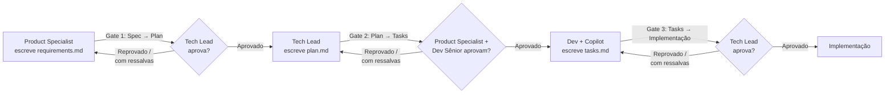

# Processo de Governança de Specs — Projeto NovaTech
## Controle de colaboração multi-papel via gates SDD (Requirements → Plan → Tasks)

**Versão:** 1.1
**Status:** Rascunho — a validar com Tech Lead e Delivery Manager (Seção 13)
**Data:** 26/08/2026
**Autor:** Delivery Manager + Tech Lead, DB1 — papel de governança de processo de entrega, distinto do Product Specialist (dono do *conteúdo* dos requirements)
**Metodologia:** SDD (Spec Driven Development) aplicado à própria produção das specs. **Este documento não define o que os requirements/plan/tasks de nenhum módulo devem conter — define como eles são escritos, aprovados, nomeados, versionados e rastreados.**
**Base utilizada:** Anexo C (estrutura de repositório, já aprovada e validada entre as equipes — este processo não a reabre nem propõe pastas novas), o Recorte de Domínio e Bounded Contexts v2.0 (Seção 6 — mapeamento módulo→contexto), o `requirements.md` do `query-endpoint` (que já usa a expressão "Gate Spec → Plan" sem defini-la formalmente), e o padrão de rastreamento que já emergiu organicamente nas duas revisões anteriores deste projeto (recorte de domínio v1→v2, requirements.md rodada 1→2).

### Nota de revisão (1.0 → 1.1) 🔧

Dois ajustes em relação à v1.0: (1) removidas as duas estruturas de pasta que a v1.0 propunha criar (`specs/<slug>/reviews/` e `specs/_ledger/gates.md`) — a estrutura de repositório do Anexo C já está aprovada e validada entre as equipes, e este processo deve operar dentro dela, não estendê-la; a rastreabilidade que essas pastas resolviam passou a vir de convenção de nomenclatura dentro das pastas já existentes e do histórico do Git (Seções 6 e 8). (2) Adicionada a Seção 1 — Convenções utilizadas, com um resumo em linguagem simples de cada termo do processo, para quem tem menos contato com SDD/Gates no dia a dia.

> **Princípio orientador:** as restrições de papel já fixadas (Requirements é do Product Specialist, Plan é do Tech Lead, Tasks é do Dev com apoio do Copilot) e a sequência Requirements → Plan → Tasks são tratadas aqui como invariantes — nenhuma regra de nomenclatura, versionamento ou repositório pode criar um atalho que permita gerar um artefato sem o anterior estar aprovado. O processo é feito para ser **dinâmico** (cresce quando o projeto cresce) e para caber **dentro** da estrutura de repositório já aprovada, não ao lado dela.

---

## 1. Convenções utilizadas

Resumo direto, para quem tem menos contato com o processo de specs, do que cada termo usado neste documento representa:

- **requirements.md** — define **o que** precisa ser feito. Outcomes de negócio, o que está dentro e fora de escopo, restrições e critérios de aceite. Não descreve tecnologia nem arquitetura.
- **plan.md** — define **como** será feito. A abordagem técnica escolhida para entregar o que o `requirements.md` pediu, apoiada nas decisões de arquitetura já tomadas (ADRs).
- **tasks.md** — decompõe o `plan.md` em unidades atômicas, pequenas e executáveis — o nível de detalhe que um Dev, com apoio de um agente de IA (Copilot), usa para implementar e testar passo a passo.
- **Gate** — um ponto de aprovação obrigatório entre uma etapa e a próxima. Nenhum artefato começa a ser escrito antes de o artefato anterior passar pelo seu Gate — é o mecanismo que impede, por exemplo, que um `plan.md` seja escrito em cima de um `requirements.md` ainda não validado.
- **Papel** — a função exercida (Product Specialist, Tech Lead, Dev), não necessariamente uma pessoa fixa. A mesma pessoa pode exercer mais de um papel num projeto pequeno, mas cada aprovação registra o papel exercido, não só o nome de quem assinou.
- **Nota de revisão** — um resumo, no topo do próprio artefato, do que mudou numa revisão e por quê — a explicação em linguagem humana de uma mudança (este próprio documento usa uma, acima).
- **Versão / Status** — todo artefato carrega uma versão (ex.: 2.0) e um status (Rascunho, Em Revisão, Aprovado, Requer Revisão, Obsoleto) no cabeçalho, para que qualquer pessoa saiba, olhando só o topo do arquivo, se aquele conteúdo já pode ser usado como base para a próxima etapa.
- **Slug de módulo** — o nome curto de uma pasta em `/specs/` (ex.: `query-endpoint`), correspondente a um módulo técnico de entrega mapeado a um ou mais bounded contexts do domínio.

---

## 2. Por que isto precisa de processo, e não só de convenção

Este projeto já produziu, organicamente, dois padrões de rastreamento sem que nenhum documento os tivesse prescrito: uma "Nota de revisão" no topo de artefatos revisados (recorte de domínio v1→v2, requirements.md rodada 2) e documentos de auditoria avulsos (`revisao-scope-boundaries-query-endpoint.md`, `revisao-verification-criteria-query-endpoint.md`). Isso funcionou numa sessão com um único par Product Specialist/Tech Lead conduzindo tudo em sequência. Não escala sozinho quando: (a) mais de um módulo está em andamento ao mesmo tempo, cada um em um estágio diferente do funil; (b) mais de uma pessoa por papel existe; (c) um agente de IA (Copilot, Claude) é quem efetivamente redige `plan.md`/`tasks.md` e precisa de uma regra explícita para não pular uma aprovação por conta própria.

Este documento formaliza o que já funcionava, para que continue funcionando quando essas três condições deixarem de ser verdade — sem inventar burocracia nova, e sem propor nenhuma pasta que a estrutura de repositório já aprovada (Anexo C) não preveja.

---

## 3. Papéis, artefatos e aprovadores

A tabela abaixo é a mesma regra já definida pelo usuário e pelo Anexo C (Seção "Convenções de organização" — `/specs/`), tornada explícita como matriz de responsabilidade:

| Artefato | Autor (R) | Aprovador (A) — Gate | Consultado (C) | Informado (I) |
|---|---|---|---|---|
| `requirements.md` | Product Specialist | **Tech Lead** (Gate 1) | Dev Sênior e Delivery Manager, se um `plan.md` já aprovado existir e for afetado por uma mudança | QA, Dev |
| `plan.md` | Tech Lead | **Product Specialist + Dev Sênior** (Gate 2) | Arquitetura/ADRs existentes | Dev, QA |
| `tasks.md` | Dev, com apoio do Copilot | **Tech Lead** (Gate 3) | Product Specialist, se uma task revelar ambiguidade de outcome não prevista no plan | QA |

Papel não é sinônimo de pessoa. Numa equipe pequena, a mesma pessoa pode acumular Product Specialist e Tech Lead — mas o registro de aprovação (Seção 8) sempre identifica **qual papel** foi exercido no momento da assinatura, nunca só um nome. Isso preserva a separação de responsabilidade mesmo quando ela está concentrada numa única pessoa, e é o que permite auditar depois se um Gate foi cumprido de fato ou só formalmente.

---

## 4. O fluxo e os Gates

A cadeia é estritamente sequencial e **gated**: nenhum `plan.md` é iniciado antes de `requirements.md` estar com `Status: Aprovado`; nenhum `tasks.md` é gerado antes de `plan.md` estar com `Status: Aprovado`. Isso vale igualmente para um agente de IA gerando o artefato — ver guardrail na Seção 10.



### Gate 1 — Spec → Plan

**Critério de entrada:** `requirements.md` cobre as 5 seções obrigatórias (Outcomes, Scope Boundaries, Constraints, Prior Decisions, Verification Criteria).

**Checklist de saída** (a mesma rubrica que este projeto já aplicou duas vezes, agora formal):
- Todo Outcome descreve um resultado observável pelo atendente/cliente/NovaTech, nunca uma capacidade técnica — o teste já usado neste projeto: "se a frase só faz sentido para quem lê código, não pertence aqui".
- Todo item de Scope Boundaries deriva de um bounded context real mapeado no Recorte de Domínio (Seção 6 daquele documento) — a checagem que a `revisao-scope-boundaries-query-endpoint.md` já aplicou.
- Toda Constraint e todo Outcome rastreiam a pelo menos um Verification Criterion, ou têm justificativa explícita para não precisar de um (o caso do O9, que é indicador pós-go-live, não critério de aceite).
- Todo VC é objetivamente testável: resultado binário ou limiar numérico definido, sem linguagem qualitativa não resolvida — a rubrica que a `revisao-verification-criteria-query-endpoint.md` já aplicou (o que não tem número ainda é marcado **[a validar]**, nunca escondido atrás de adjetivo).
- A tabela de Prior Decisions não reabre nenhuma ADR silenciosamente.

**Aprovador:** Tech Lead. **Efeito da aprovação:** `Status → Aprovado`, versão congelada (Seção 7), liberado para `plan.md` começar.
**Efeito da reprovação:** `Status` permanece `Em Revisão`, versão minor incrementada a cada rodada, Nota de revisão atualizada (Seção 8).

### Gate 2 — Plan → Tasks

**Critério de entrada:** `plan.md` escrito a partir de um `requirements.md` com `Status: Aprovado`, endereçando 100% dos outcomes/constraints/VCs herdados — sem reabrir nenhum deles.

**Checklist de saída:**
- `plan.md` decide **como**, nunca redefine **o quê** — nenhum outcome, scope boundary ou constraint é reescrito aqui; se um deles se mostrar impraticável, isso volta para o Gate 1, não é ajustado silenciosamente no plan.
- Toda decisão técnica nova cita a ADR correspondente, ou propõe uma nova ADR quando o ponto ainda está em aberto.
- Cada Verification Criterion do `requirements.md` tem um caminho claro de como será testado — é a base direta do `test-plan.md` do QA.
- As Constraints (C1–C6) são respeitadas explicitamente, não implicitamente (ex.: como C4 — confidencialidade — é tecnicamente garantida).

**Aprovador:** Product Specialist (outcomes continuam preservados) **e** Dev Sênior (viabilidade técnica) — os dois, não um ou outro. **Efeito da aprovação:** `Status → Aprovado`, liberado para `tasks.md`.
**Efeito da reprovação:** volta ao Tech Lead, versão minor incrementada, Nota de revisão atualizada.

### Gate 3 — Tasks → Implementação

Não fazia parte da pergunta original, mas está implícito na própria convenção do Anexo C ("tasks.md — gerado pelo Dev com apoio do Copilot, aprovado pelo Tech Lead") e é incluído aqui por completude da cadeia.

**Checklist de saída:** cada task mapeia 1:1 a uma seção do `plan.md` aprovado (nenhuma task "solta" sem rastro); tasks são pequenas o suficiente para serem testadas individualmente; tasks referenciam as skills de `/skills/artifact/` aplicáveis, quando existirem.
**Aprovador:** Tech Lead.

---

## 5. Nomenclatura das specs

**Slug de módulo:** identificador curto em kebab-case, que só nasce quando ganha uma linha própria na tabela de mapeamento módulo→bounded context (Recorte de Domínio, Seção 6). Hoje: `pipeline-ingestao`, `query-endpoint`, `feedback-api`, `teams-bot`, `painel-web`. Nenhum módulo novo entra em `/specs/` sem essa linha existir primeiro — é o que impede um dev de criar um módulo técnico que não corresponde a nenhuma responsabilidade de domínio real.

**Nome de arquivo:** fixo dentro de cada pasta de módulo — `requirements.md`, `plan.md`, `tasks.md` — exatamente como já está no Anexo C. A versão **não** entra no nome do arquivo (nunca `requirements-v2.md`); ela vive só no cabeçalho do próprio documento (Seção 7). Isso evita que artefatos antigos fiquem soltos no repositório competindo com o vigente — há sempre um único arquivo por artefato, e a versão anterior existe apenas no histórico do Git.

**Documentos de revisão/auditoria:** o padrão que este projeto já usa (`revisao-<aspecto>-<slug>.md`) é mantido como convenção formal — o nome descreve **o que foi revisado**, não quando (a data já vive no cabeçalho do arquivo e no commit). Exemplos já existentes: `revisao-scope-boundaries-query-endpoint.md`, `revisao-verification-criteria-query-endpoint.md`. Onde esses arquivos ficam dentro da estrutura já aprovada — Seção 6.

---

## 6. Onde ficam no repositório — dentro da estrutura já aprovada

A estrutura de repositório definida no Anexo C já foi aprovada e validada entre as equipes — este processo **não cria nenhuma pasta nova**. Os três artefatos continuam exatamente onde já estão:

```
specs/
├── query-endpoint/
│   ├── requirements.md
│   ├── plan.md
│   └── tasks.md
├── pipeline-ingestao/
│   └── ...
├── feedback-api/
│   └── ...
├── teams-bot/
│   └── ...
└── painel-web/
    └── ...
```

Os documentos de revisão/auditoria (padrão `revisao-<aspecto>-<slug>.md`, Seção 5) ficam **na mesma pasta** dos três artefatos, sem subpasta própria — o prefixo `revisao-` já os distingue visualmente dos artefatos principais:

```
specs/query-endpoint/
├── requirements.md
├── plan.md
├── tasks.md
├── revisao-scope-boundaries-query-endpoint.md
└── revisao-verification-criteria-query-endpoint.md
```

A visão consolidada entre módulos (quem aprovou o quê, quando) não depende de um arquivo central novo. Ela vem de duas fontes que já existem: o cabeçalho de cada artefato (Versão/Status/Aprovador, Seção 7) e o histórico do Git, filtrado pela convenção de commit descrita na Seção 8 — sem exigir a manutenção de um arquivo agregador que pode divergir do estado real dos artefatos.

Dois pontos de reaproveitamento da árvore existente, sem alteração:
- **`docs/adr/`** continua sendo o lugar de decisões de arquitetura que um Gate revele como necessárias (ex.: Gate 2 exige uma decisão técnica ainda não tomada) — uma ADR nunca é criada dentro de `specs/`, pois ADR é decisão que atravessa módulos.
- **`docs/runbooks/`** é o lugar de artefatos de acompanhamento pós-go-live que não são gate de implementação — o caso do `plano-medicao-outcome-o9-novatech.md`, que por definição não tem VC e não bloqueia nenhum Gate (Seção 9).

---

## 7. Versionamento

Todo artefato (`requirements.md`, `plan.md`, `tasks.md`) carrega um cabeçalho padronizado — o mesmo formato que os documentos-fonte da própria NovaTech já usam (POL-001, SLA-2024) e que este projeto já reproduziu em seus próprios entregáveis:

```
**Versão:** X.Y
**Status:** Rascunho | Em Revisão | Aprovado | Requer Revisão | Obsoleto
**Última atualização:** DD/MM/AAAA
**Autor:** <papel>
**Aprovador:** <papel> — preenchido somente quando Status = Aprovado
```

**Regra de incremento:**

- **Minor (2.0 → 2.1):** ajuste dentro da mesma rodada de Gate, artefato ainda não aprovado — o padrão já usado (requirements.md "rodada 2").
- **Congelamento na aprovação:** a versão aprovada num Gate vira a referência citada pelo artefato seguinte (ex.: `plan.md` declara "baseado em requirements.md v2.0"). Essa citação é obrigatória no cabeçalho do artefato posterior — é o que torna a cadeia rastreável sem precisar abrir o Git.
- **Major (2.0 → 3.0):** mudança num artefato **já aprovado e já consumido** por um artefato posterior (ex.: `requirements.md` muda depois que `plan.md` já existe). Isso força automaticamente `Status → Requer Revisão` no(s) artefato(s) posteriores — nunca fica em aberto silenciosamente qual dos dois está desatualizado.

**Duas fontes de verdade, deliberadamente:** o cabeçalho (legível por humano, resume o *porquê* da mudança) e o histórico do Git local já configurado no `.mcp/mcp.json` do Anexo C (legível por máquina, prova o *quando* e o *o quê* exatamente mudou, via `git log --follow` no arquivo). Nesta fase de simulação não há remoto nem PRs (nota do Anexo C); quando o projeto sair dessa fase, a mesma convenção migra para tags de PR sem mudar o processo em si — só o lugar onde o Git vive.

---

## 8. Rastreamento de mudanças

**Nota de revisão obrigatória:** todo artefato que já teve ao menos uma aprovação carrega, no topo, uma seção "Nota de revisão" — exatamente o formato já usado no recorte de domínio ("v1 → v2") e no requirements.md ("rodada 2"), e que este próprio documento usa acima. Quando a mudança pontual dentro do texto precisa ser sinalizada, usa-se a marcação inline 🔧 já adotada neste projeto — mantida como convenção obrigatória, não estética.

**Convenção de commit Git**, para que o histórico funcione como segunda fonte de verdade sem precisar abrir arquivo nenhum:

```
spec(<slug>): <artefato> <versão> — <gate ou motivo>
```

Exemplos:
```
spec(query-endpoint): requirements.md v2.0 — Gate Spec→Plan aprovado
spec(query-endpoint): requirements.md v2.1 — ajuste VC-01/07/10 (revisão de testabilidade)
spec(query-endpoint): plan.md v1.0 — rascunho inicial pós Gate 1
```

**Consolidação entre módulos, sem arquivo central:** a visão de todos os Gates já ocorridos no projeto vem do próprio histórico do Git, filtrado pela convenção acima — por exemplo:

```
$ git log --oneline --grep="Gate" -- specs/query-endpoint/
a1b2c3d spec(query-endpoint): requirements.md v3.0 — Gate Spec→Plan aprovado após adição de VC-11 a VC-14
e4f5g6h spec(query-endpoint): requirements.md v2.0 — Gate Spec→Plan aprovado após correção de escopo (BC-3 não declarado)
i7j8k9l spec(query-endpoint): requirements.md v1.0 — Gate Spec→Plan aprovado
```
*(hashes ilustrativos)*

Rodar o mesmo comando sem restringir a pasta (`-- specs/`) dá a visão entre todos os módulos. Isso evita manter um segundo arquivo (um "ledger") sincronizado manualmente com o estado real dos artefatos — a única exigência é seguir a convenção de commit ao mudar um `Status`.

---

## 9. Como o processo evolui (dinamismo)

- **Novo módulo técnico:** só nasce quando a tabela de mapeamento da Seção 6 do Recorte de Domínio ganha uma nova linha. Exemplo já previsto no próprio recorte: se "Sinistro e Seguro" (hoje órfão dentro do BC-6) for formalizado, vira um módulo `sinistros-seguros` com sua própria pasta `specs/sinistros-seguros/`, seguindo exatamente esta mesma estrutura — nenhuma regra nova precisa ser inventada para isso.
- **Novo tipo de documento de revisão:** quando surgir uma checagem de qualidade ainda não existente (este projeto já criou duas: coerência de scope boundaries, testabilidade de VC), ela simplesmente vira mais um arquivo `revisao-<aspecto>-<slug>.md` dentro da própria pasta `specs/<slug>/` (Seção 6) — não exige nova subpasta nem aprovação de processo para ser criado.
- **Indicador pós-go-live sem VC (o caso O9):** não é uma falha deste processo — é, deliberadamente, um terceiro tipo de artefato (`plano-medicao-*.md`) que vive fora de `specs/<slug>/`, porque não é um Gate de implementação e não tem QA testando antes do go-live. Local sugerido: `docs/runbooks/`, já que o Anexo C define runbooks como "operacionais" — e um plano de medição pós-lançamento é exatamente isso.
- **Revisão periódica do próprio processo:** este documento reaproveita, de propósito, a mesma lógica que o BC-3 (Governança Documental) aplica às fontes de negócio da NovaTech — SLA de revisão periódica — aplicada a si mesmo. Sugestão: revisar este processo a cada novo módulo adicionado a `specs/`, ou semestralmente, o que vier primeiro. Sem essa cláusula, este documento correria o mesmo risco que o PROC-042 v1 correu: ficar tecnicamente vigente e silenciosamente desatualizado.

---

## 10. Guardrail para agentes de IA (a incorporar no `AGENTS.md`)

Quem efetivamente redige `plan.md` e `tasks.md` com apoio de IA precisa de uma regra que não dependa de disciplina humana para ser seguida. Proposta de texto para a constituição do projeto (`AGENTS.md`, hoje vazio conforme o estado atual do Anexo C):

> Nunca gerar `plan.md` para um módulo cujo `requirements.md` não esteja com `Status: Aprovado`. Nunca gerar `tasks.md` para um módulo cujo `plan.md` não esteja com `Status: Aprovado`. Se o usuário pedir explicitamente para pular um Gate, alertar antes de prosseguir sobre o que exatamente está sendo pulado e por quê — nunca pular silenciosamente.

Essa regra é a mesma lógica de O3/O6 do `requirements.md` do `query-endpoint` (nunca resolver silenciosamente uma divergência, nunca inverter uma restrição explícita), aplicada de forma reflexiva ao processo que produz as próprias specs.

---

## 11. Checklist resumido por Gate

| Gate | De → Para | Aprovador | Critério mínimo de saída | Se reprovado |
|---|---|---|---|---|
| **1 — Spec → Plan** | `requirements.md` → `plan.md` | Tech Lead | Outcomes não-técnicos; scope coerente com bounded contexts; todo Outcome/Constraint rastreado a um VC ou justificado; todo VC testável | `Status: Em Revisão`, versão minor, Nota de revisão |
| **2 — Plan → Tasks** | `plan.md` → `tasks.md` | Product Specialist + Dev Sênior | Não reabre outcomes/escopo; cita ADRs; cobre 100% dos VCs herdados; respeita Constraints | `Status: Em Revisão`, versão minor, Nota de revisão |
| **3 — Tasks → Implementação** | `tasks.md` → código | Tech Lead | Tasks mapeiam 1:1 ao plan; testáveis individualmente; referenciam skills aplicáveis | `Status: Em Revisão`, versão minor, Nota de revisão |

---

## 12. Riscos e pontos de atenção

1. **Burocratizar um processo que deveria ser dinâmico.** Mitigação: o processo não introduz nenhuma pasta ou arquivo estrutural além do que o Anexo C já aprovou — os documentos de revisão convivem na mesma pasta dos três artefatos principais, e a consolidação entre módulos vem do Git, não de um artefato adicional para manter atualizado.
2. **Papel concentrado numa única pessoa mascarando a separação de responsabilidade.** Mitigação já embutida na Seção 3: o registro de aprovação exige o papel exercido, não só o nome — torna visível, numa auditoria, quando a mesma pessoa aprovou nos dois lados de um Gate.
3. **Nota de revisão pulada sob pressão de prazo por um agente de IA gerando o artefato rapidamente.** Mitigação: Seção 10 torna isso regra do `AGENTS.md`, não apenas convenção documental — a única forma de um guardrail sobreviver à pressa é estar onde o agente é obrigado a ler antes de agir.
4. **Consolidação via Git depende de disciplina na convenção de commit (Seção 8).** Um commit que não siga o padrão `spec(<slug>): ...` não aparece na consolidação por `git log --grep`. Mitigação: por não existir um segundo lugar (um ledger) para sincronizar manualmente, o único ponto de falha é o próprio commit — cabe ao Tech Lead revisar o padrão de commit no momento do Gate, não depois.
5. **Pressupõe que todo módulo futuro nasce de uma linha no Recorte de Domínio.** Se a NovaTech trouxer um módulo cuja necessidade não é claramente derivada de um bounded context existente (ex.: um requisito puramente de infraestrutura, sem contraparte de negócio), este processo não cobre esse caso — ele precisaria, primeiro, de uma decisão explícita de que tipo de artefato aquilo é, antes de entrar em `specs/`.

---

## 13. Próximos passos sugeridos

1. Validar esta proposta com o Tech Lead e o Delivery Manager antes de aplicá-la retroativamente.
2. Posicionar os documentos `revisao-*.md` já entregues (scope boundaries, verification criteria) dentro de `specs/query-endpoint/`, junto dos três artefatos, conforme Seção 6.
3. Adotar a convenção de commit da Seção 8 a partir do próximo commit que alterar qualquer artefato de `specs/`.
4. Incorporar a regra da Seção 10 ao `AGENTS.md` quando ele for escrito (hoje vazio, conforme o estado atual do Anexo C).
5. Aplicar este processo, desde o início, ao próximo módulo que ganhar um `requirements.md` — o teste real deste documento é funcionar num módulo que ainda não existe, não só descrever o que já aconteceu no `query-endpoint`.
