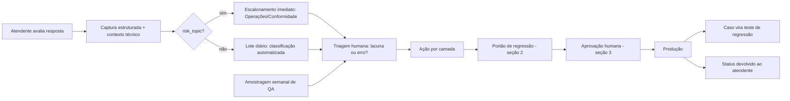

# Harness de Produto — Melhoria Contínua do Assistente NovaTech

**Projeto:** IA-First Certification — DGS (DB1 Global Software)
**Fase:** Cenário 3 — Harness e Governança
**Exercício:** 3.2
**Autor:** Rodrigo (Product Specialist) + Claude (análise crítica e consolidação)
**Versão:** 1.0
**Status:** Proposto
**Base:** Rascunho original de Rodrigo (v0) + crítica do Claude contra os critérios do exercício + revisão consolidada (v0.1)

---

## 0. Objetivo, escopo e rastreabilidade

### 0.1 Objetivo

Definir como o assistente NovaTech evolui após o go-live **sem degradar**. O documento cobre três coisas:
- quais métricas de qualidade são monitoradas;
- como o feedback do atendente vira melhoria efetiva;
- como cada mudança é validada (regression testing de produto) e aprovada por humanos antes de ir para produção.

### 0.2 Relação com artefatos anteriores

| Artefato | Papel neste harness |
|---|---|
| `guardrails-novatech-v1.1.md` (Cenário 2) | Referência que **não pode regredir**. Os 14 guardrails (D1–D5, N1–N4, F1–F4) compõem a base do conjunto de regressão. |
| `proposta-ajustes-harness-v1.0.md` (Exercício 3.1) | Fornece a taxonomia de camadas, o schema de structured output, as regras HITL-1 a HITL-4 (em tempo de execução) e o Caso 5 como calibração positiva. |
| AGENTS.md | Regra de revisão obrigatória para código gerado por Copilot (incidente do módulo de feedback). |

### 0.3 Legenda de origem (processo "humano primeiro, IA depois")

Cada item indica sua origem:

| Marca | Significado |
|---|---|
| **[R]** | Proposto no rascunho original de Rodrigo (v0), antes de qualquer análise da IA |
| **[R+C]** | Ideia original de Rodrigo, expandida a partir da crítica do Claude |
| **[C]** | Incorporado da crítica do Claude, revisado e aceito por Rodrigo |

### 0.4 Cobertura dos critérios do exercício

| Critério | Onde é atendido |
|---|---|
| Processo de feedback completo, do atendente até a melhoria efetiva | Seção 1 (captura 1.1 → triagem 1.5/1.6 → ação 1.7 → validação 1.9 → teste 1.10 → retorno ao atendente 1.11) |
| Regression testing reconhece efeitos colaterais e verifica que os guardrails não regridem | Seções 2.1 (efeitos colaterais), 2.3 (guardrails da v1.1) e 2.5 (zero regressão em NÃO DEVE) |
| HITL concreto: o que precisa de aprovação e quem aprova | Seções 3.2 (papéis), 3.3 (critério de risco) e 3.4 (matriz tipo × risco × aprovador) |

---

## 1. Processo de feedback

### 1.0 Visão do ciclo

### 1.1 Captura [R+C]

Toda resposta exibe polegar para cima e polegar para baixo.

O polegar para cima também é registrado, por dois motivos:
- sem ele não existe denominador para as métricas;
- é a fonte de novos exemplos positivos, como o Caso 5.

Ao acionar o polegar para baixo, o atendente escolhe um motivo. Cada motivo aponta para os guardrails relacionados:

| Motivo | Guardrails relacionados |
|---|---|
| Resposta errada | N1, F4 |
| Resposta incompleta | D2, D3 (padrão dos casos 1 e 2 do 3.1) |
| Sem fonte | D4, HITL-4 |
| Documento desatualizado | D1, N3, F1 |
| Não encontrou a informação | D3, N4, F3 |
| Resposta sem nexo | D5, F4 |

Há também um campo livre opcional para comentário.

### 1.2 Contexto técnico salvo automaticamente [C]

O atendente não precisa descrever nada técnico. Junto com o feedback, o sistema registra:
- a pergunta e a resposta entregue;
- os chunks recuperados, com documento, seção e versão;
- a versão do prompt e do pipeline em produção;
- o JSON de structured output (`source_document`, `source_section`, `confidence_score`, `risk_topic`, `requires_human_review`);
- as regras HITL acionadas, se houver.

### 1.3 Proteção de dados na captura [C]

- A identificação do atendente é pseudonimizada.
- O payload do feedback é validado com Zod antes de ser persistido.
- Nenhum dado pessoal ou sensível vai para log.

> Justificativa: o módulo de feedback gerado pelo Copilot violou exatamente essas regras do AGENTS.md. Este fluxo já falhou uma vez e por isso tem controle explícito.

### 1.4 Escalonamento imediato para tema de risco [C]

Um feedback negativo com `risk_topic = true` (carga perigosa, compliance, reembolso/valores, classificação regulatória) **não espera o lote diário**. Ele é encaminhado na hora para Operações/Conformidade.

### 1.5 Triagem diária [R]

Uma rotina automatizada diária faz três coisas:
1. coleta os feedbacks do dia;
2. classifica e agrupa os feedbacks por padrão;
3. gera um relatório para análise do Product Specialist.

**[C] Complemento:** a classificação automatizada também é feita por IA, portanto é probabilística. Ela é tratada como **sugestão**, e a classificação final é sempre confirmada por uma pessoa.

### 1.6 Primeiro corte: lacuna ou erro [C]

Antes de qualquer outra classificação, a triagem separa dois casos:

| Classe | Definição | Exemplo | Caminho |
|---|---|---|---|
| **Lacuna** | A informação não existe na base de conhecimento | Caso 5 (tier "Enterprise") | Conteúdo/corpus ou Interface-Produto |
| **Erro** | A informação existia e o assistente errou (recuperação, geração ou citação) | INC-03 (SLA Gold indexado, respondido como inexistente) | Pipeline, Prompt ou Harness |

Lacunas **não entram** na taxa de erro do assistente. Elas são medidas em métrica própria (1.12), porque misturar as duas classes distorce os indicadores de qualidade.

### 1.7 Ação sugerida por camada [R+C]

A classificação sugere a ação usando a taxonomia do 3.1. A camada de conteúdo foi separada do pipeline técnico porque tem outro dono.

| Camada | Ações possíveis |
|---|---|
| Conteúdo/corpus | Novo documento, nova versão de documento, correção de metadado (`versao_status`, `categoria_carga`) |
| Pipeline | Reindexação, ajuste de chunking, ajuste de busca (reformulação, sinônimos) |
| Prompt | Ajuste de instrução, novos exemplos few-shot |
| Interface-Produto | Novo fluxo (ex.: solicitação de novo tier), mudança de exibição |
| Harness | Nova regra de validação, de bloqueio ou de HITL |

### 1.8 Amostragem independente de QA [C]

O atendente só aponta o erro que percebe. Uma resposta errada e convincente, como a do caso 6 (fonte inventada com confiança alta), não recebe polegar para baixo.

Para cobrir esse ponto cego, uma amostra semanal de respostas é revisada **independentemente de feedback**:
- tamanho da amostra: ver parâmetro P-01;
- respostas com `risk_topic = true` têm peso maior na amostra;
- a revisão também atende à exigência de avaliação humana amostral dos guardrails [P] da v1.1.

### 1.9 Validação antes de virar fonte oficial ou produção [R+C]

Nenhuma correção vai direto para produção. Toda correção passa pelo portão de regressão (seção 2) e pela aprovação humana (seção 3).

Regra adicional para **documento novo ou nova versão**:
- o documento precisa vir da área dona do conteúdo;
- ele entra na lista oficial de fontes do schema;
- os metadados obrigatórios (`versao_status`, `categoria_carga` quando aplicável) precisam estar preenchidos.

Sem entrar na lista oficial, o documento seria bloqueado pelo HITL-2, e esse é o comportamento correto.

### 1.10 Todo erro corrigido vira teste [C]

O caso que originou o feedback entra no conjunto de regressão (2.3). Isso impede que o mesmo erro volte em mudanças futuras e é o que liga o processo de feedback ao regression testing.

### 1.11 Retorno ao atendente [C]

Cada feedback tem um status visível para quem o abriu:

`recebido` → `em análise` → `corrigido` | `não procede` | `lacuna registrada`

Fechar o ciclo com o atendente mantém o engajamento com o feedback e dá transparência sobre o que foi feito com o apontamento.

### 1.12 Métricas monitoradas [R+C]

| ID | Métrica | Leitura |
|---|---|---|
| M-01 | Taxa de erro do assistente (feedbacks negativos classificados como **erro** ÷ total de respostas) | Linha de base: 12% (testes internos pré-go-live). Deve cair. |
| M-02 | Taxa de lacuna (feedbacks classificados como **lacuna** ÷ total de respostas) | Indicador de cobertura do corpus, não de qualidade do assistente. |
| M-03 | Funil: negativos → corrigidos → validados com sucesso [R] | Mede a capacidade de transformar feedback em melhoria. |
| M-04 | Lead time do feedback até a correção em produção | Mede a velocidade do ciclo. |
| M-05 | Taxa de reincidência (erro corrigido que volta a ocorrer) | Deve tender a zero se 1.10 funcionar. |
| M-06 | Taxa de HITL acionado ÷ total de respostas [R] | Ler sempre junto com M-01 e M-07 (ver nota). |
| M-07 | Taxa de bloqueio excessivo (HITL acionado em resposta que estava correta) | Detecta harness rígido demais. |
| M-08 | Taxa de erro na amostragem de QA (1.8) | Mede o erro que o atendente não percebe. |

> **Nota sobre M-06:** uma queda na taxa de HITL pode significar que o assistente melhorou ou que uma regra ficou frouxa. Por isso ela nunca é lida isoladamente: HITL em queda com M-01 e M-08 estáveis ou em queda é bom sinal; HITL em queda com M-08 subindo é alerta.

---

## 2. Regression testing de produto

### 2.1 Por que testar o conjunto inteiro [C]

Em IA, uma mudança pequena produz efeitos colaterais em lugares inesperados. Dois exemplos:
- **Documento novo:** pode mudar o ranking de recuperação de perguntas que não têm relação com ele, deslocando chunks corretos.
- **Ajuste de prompt:** uma instrução para resolver a ambiguidade do caso 1 pode quebrar a forma como o assistente declara ausência de informação (F3) ou o tom formal (D5).

Rodar apenas os casos relacionados à mudança não detecta nenhum dos dois efeitos. Por isso **o conjunto inteiro roda a cada mudança**.

### 2.2 Gatilhos do portão de regressão [R+C]

O portão roda obrigatoriamente nos seguintes casos:

| Gatilho | Origem |
|---|---|
| Toda ingestão de dados ou nova versão de documento | [R] |
| Toda alteração no harness ou em qualquer estrutura do projeto (prompt, pipeline, interface que afete a resposta) | [R] |
| Troca ou atualização de modelo ou de modelo de embedding, **inclusive atualização feita pelo provedor (Azure)**, que não parte do time | [C] |
| Execução periódica semanal, mesmo sem mudança, para detectar deriva | [C] |

### 2.3 Conjunto de referência (golden set) [R+C]

| Grupo | Conteúdo | Origem |
|---|---|---|
| G1 — Guardrails do cenário 2 | Pelo menos um caso por guardrail da v1.1: D1–D5, N1–N4, F1–F4 (14 guardrails) | [C] |
| G2 — Incidentes | INC-01 (carga perigosa), INC-02 (PROC-042 v1/v2), INC-03 (SLA Gold) | [C] |
| G3 — Staging 3.1 | Os 6 casos avaliados no exercício 3.1 | [C] |
| G4 — Calibração positiva | Caso 5: **deve passar**. Se for bloqueado, o harness ficou rígido demais | [C] |
| G5 — Feedbacks corrigidos | Casos originados do item 1.10 | [C] |
| G6 — Novas regras | Todo novo guardrail ou regra de harness entra no conjunto **junto com** seus casos de teste | [R] |

### 2.4 Como verificar [C]

**Checagens determinísticas (regra de código, sem interpretação):**
- schema de structured output completo e válido;
- `source_document` pertence à lista oficial;
- versão citada é a vigente (D1, N3);
- bloqueio de fonte nula (HITL-4);
- regra de categoria especial de carga (N2);
- **na ingestão:** presença de `versao_status` e `categoria_carga`. Sem esses metadados, os guardrails [D] passam a ser [P] na prática, conforme a premissa crítica da seção 0.1 da v1.1.

**Checagens probabilísticas (guardrails [P]):**
- avaliação por LLM-as-judge com rubrica derivada da v1.1;
- conferência humana de uma amostra dos julgamentos;
- cada caso roda mais de uma vez (parâmetro P-02), porque a mesma pergunta pode gerar respostas diferentes. O caso só passa se atingir o limiar em todas as execuções definidas.

### 2.5 Critério de aprovação do portão [C]

| Verificação | Exigência |
|---|---|
| Checagens determinísticas | 100% de aprovação |
| Guardrails NÃO DEVE (N1–N4) | Zero regressão em relação à versão em produção |
| Caso 5 (G4) | Continua passando |
| Qualidade geral | Queda máxima em relação à versão em produção: parâmetro P-03 |

Se qualquer item falhar, a mudança **não segue** para aprovação.

### 2.6 Resultado do portão [C]

O portão gera um **relatório comparativo antes/depois** contra a versão em produção. O relatório lista casos que melhoraram, pioraram e ficaram iguais, organizados por grupo (G1–G6).

Esse relatório é a evidência obrigatória que o aprovador da seção 3 precisa ver.

---

## 3. Ponto de human-in-the-loop — governança de mudanças

### 3.1 Diferença em relação ao HITL do 3.1 [C]

| | HITL-1 a HITL-4 (Exercício 3.1) | HITL de mudança (este documento) |
|---|---|---|
| O que revisa | Respostas individuais | Mudanças no assistente |
| Quando | Em tempo de execução, antes de a resposta chegar ao atendente | Antes de a mudança ir para produção |
| Gatilho | Combinação de campos do structured output | Qualquer mudança classificada na matriz 3.4 |

### 3.2 Papéis de aprovação [R+C]

O rascunho original propunha os perfis operador, assistente, analista e supervisor. Eles foram substituídos por papéis de **responsabilidade pelo impacto**. Aprovar mudança em IA exige quem responde pelo resultado, e o perfil "assistente" se confundia com o próprio assistente de IA.

| Papel | Responde por |
|---|---|
| **Product Specialist (PS)** | Comportamento do assistente, guardrails e métricas |
| **Tech lead** | Parte técnica: código, pipeline, modelo e integração |
| **Dono do conteúdo** | Área de negócio responsável pelo documento (ex.: dono de POL-001, PROC-042, SLA-2024) |
| **Operações/Conformidade** | Temas de risco: carga perigosa, compliance, valores e reembolso |

### 3.3 Critério de classificação de risco [C]

| Risco | Quando se aplica |
|---|---|
| **Alto** | Toca tema de risco (`risk_topic`), guardrail, regra de harness, modelo ou documento normativo (POL, PROC, SLA) |
| **Médio** | Altera a busca, o prompt, um fluxo da interface ou um documento não normativo (ex.: FAQ) |
| **Baixo** | Texto ou layout de interface, ou correção de documento sem conteúdo normativo |

Na dúvida entre dois níveis, vale o mais alto.

### 3.4 Matriz de aprovação [R+C]

Estrutura (tipo × risco × aprovador) proposta no rascunho original [R]; papéis, tipos adicionais e preenchimento incorporados da crítica [C].

| Tipo de mudança | Baixo | Médio | Alto |
|---|---|---|---|
| **Conteúdo/corpus** | Dono do conteúdo | Dono do conteúdo + PS | Dono do conteúdo + PS + Conformidade |
| **Pipeline** | Tech lead (reindexação sem mudar configuração) | Tech lead + PS (chunking, busca) | Tech lead + PS + Conformidade (troca de embedding ou modelo) |
| **Prompt** | *não existe* | PS + Tech lead | PS + Tech lead + Conformidade |
| **Interface-Produto** | PS (texto, layout) | PS + Tech lead (novo fluxo) | PS + Tech lead + Operações (muda a exibição de fonte, confiança ou aviso de HITL) |
| **Harness** | *não existe* | PS + Tech lead (ajuste de limiar, ex.: janela N do HITL-3) | PS + Tech lead + Conformidade (regra nova, removida ou afrouxada) |
| **Guardrail** | *não existe* | *não existe* | PS + Tech lead + Conformidade, com o conjunto de regressão (G1) atualizado **antes** da mudança |

**Por que algumas células não existem:**
- **Prompt de risco baixo:** todo prompt afeta todas as respostas.
- **Harness de risco baixo:** qualquer regra de bloqueio muda o comportamento do sistema.
- **Guardrail abaixo de alto:** alterar um guardrail muda a própria referência da regressão.

### 3.5 Regras gerais de aprovação [C]

1. Nenhuma mudança vai para produção sem aprovação humana.
2. Quem implementa a mudança não aprova a própria mudança.
3. Toda aprovação exige três evidências: relatório do portão (2.6), descrição da mudança e plano de rollback.
4. Código gerado por Copilot passa por revisão contra o AGENTS.md antes da aprovação (validação Zod, tratamento de dados sensíveis).
5. Aprovações ficam registradas com data, aprovadores e versão aprovada, para auditoria.

### 3.6 Caminho de emergência [C]

Se um erro grave chegar à produção (ex.: resposta incorreta sobre carga perigosa):
- o PS ou o tech lead podem **reverter para a última versão aprovada** sem passar pela matriz;
- o rollback é comunicado a Operações/Conformidade no mesmo dia;
- a correção definitiva segue o fluxo normal: feedback → regressão → aprovação.

O caminho de emergência só permite **voltar** a um estado já aprovado. Nunca permite subir uma mudança nova sem aprovação.

---

## 4. Parâmetros a confirmar

Valores sugeridos na consolidação, sem base em dados do cenário. Devem ser confirmados com o time antes da vigência.

| ID | Parâmetro | Valor sugerido | Usado em |
|---|---|---|---|
| P-01 | Tamanho da amostragem semanal de QA | 30 respostas/semana, com peso maior para `risk_topic` | 1.8 |
| P-02 | Execuções por caso probabilístico no portão | 3 execuções | 2.4 |
| P-03 | Queda máxima de qualidade geral tolerada | 2 pontos percentuais em relação à produção | 2.5 |
| P-04 | Prazo de retorno do escalonamento de risco | A definir com Operações/Conformidade | 1.4 |

---

## 5. Glossário

| Termo | Definição neste documento |
|---|---|
| **Harness de produto** | Conjunto de métricas, processo de feedback, regression testing e aprovações que garante que o assistente melhore sem degradar |
| **Lacuna** | Informação ausente da base de conhecimento. Não é erro do assistente |
| **Erro** | Informação presente na base, mas recuperada, gerada ou citada de forma incorreta |
| **Golden set** | Conjunto de referência de perguntas e comportamentos esperados, usado no portão de regressão |
| **Portão de regressão** | Etapa obrigatória que roda o golden set completo e compara com a versão em produção |
| **Calibração positiva** | Caso que o harness deve deixar passar (Caso 5), usado para detectar bloqueio excessivo |
| **Guardrail [D] / [P]** | Determinístico (verificável por regra de código) ou probabilístico (depende de julgamento), conforme a v1.1 |
| **HITL de execução** | Revisão humana de respostas individuais (HITL-1 a HITL-4, Exercício 3.1) |
| **HITL de mudança** | Aprovação humana de alterações no assistente antes da produção (seção 3) |
| **Deriva** | Piora de qualidade sem mudança do time, por exemplo após atualização do modelo pelo provedor |
| **Bloqueio excessivo** | HITL ou regra de harness acionados em resposta que estava correta |

---

## Changelog

| Versão | Data | Alteração |
|---|---|---|
| v0 | 2026-09-22 | Rascunho original de Rodrigo (feedback, regressão e matriz de aprovação), produzido antes da análise da IA |
| v0.1 | 2026-09-22 | Revisão do rascunho incorporando a crítica do Claude contra os critérios do exercício |
| v1.0 | 2026-09-22 | Consolidação final com marcação de origem, métricas identificadas, parâmetros a confirmar e glossário |
